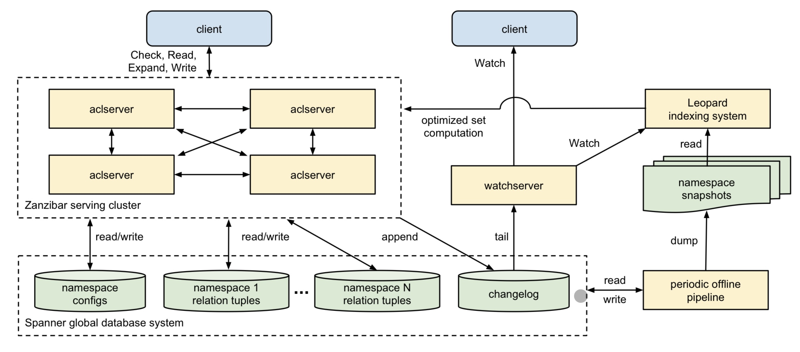

# Janzibar

Janzibar 是第一个以Java语言实现Google在2019年发表的论文*Zanzibar：Google’s Consistent, Global Authorization System*的星际级权限框架控制列表系统。

借助于Janzibar，你可以轻松实现细粒度的权限控制，并且以极低的延迟查询、修改用户或资源的权限，并在全球范围内保证权限的严格一致性。

## 快速开始

## 基本概念

### ACL（Access Control List）

​		访问控制列表（Access Control List）是一种用于控制用户或系统如何访问某个资源的列表。ACL通常由系统管理员配置，可以限制用户对某个文件、目录或系统资源的访问权限，保护系统免受未经授权的访问和攻击。

### 关系元组（Relation Tuples）

​		在运行时，Zanzibar 允许客户端通过远程过程调用 (RPC) 接口创建、修改和评估访问控制列表 (ACL)。一个简单的 ACL 可以采用“**用户** S 对**对象** O 有**关系** R”的形式。更复杂的 ACL 可以采用“一组（set）**用户** S 对**对象** O 有**关系** R”的形式，其中 S 本身是根据另一个对象关系对来指定的。ACL 可以引用其他 ACL，例如指定可以在视频上发表评论的用户集合包括那些已被授予在特定视频上查看权限的用户以及在视频频道上具有查看权限的用户。

​		在 Zanzibar 中，ACL 是表示为**关系元组**（Tuples）的**对象**（Object）- **用户**（User）或**对象**（Object）- **对象**（Object）关系的集合。而**群组**（Group）是一些具有用户关系的ACL的集合。关系元组具有高效的**二进制编码**，但在本文中，我们使用方便的**文本表示法**来表示它们： 

```
⟨tuple⟩ ::= ⟨object⟩‘#’⟨relation⟩‘@’⟨user⟩ 
⟨object⟩ ::= ⟨namespace⟩‘:’⟨object id⟩ 
⟨user⟩ ::= ⟨user id⟩ | ⟨userset⟩ 
⟨userset⟩ ::= ⟨object⟩‘#’⟨relation⟩
```

​		其中，⟨namespace⟩ 和 ⟨relation⟩ 在客户端配置中预定义，⟨object id⟩ 是一个字符串，而 ⟨user id⟩ 是一个整数。用于标识关系元组的主键是 ⟨namespace⟩、⟨object id⟩、⟨relation⟩ 和 ⟨user⟩。

​		需要注意，⟨userset⟩ 允许 ACL 引用，从而支持表示嵌套组成员资格。 下面的例子显示了一些示例元组及其相应的语义。

文本表示法表示的一些关系元组的示例：

```
doc:readme#owner@10
group:eng#member@11
doc:readme#viewer@group:eng#member
doc:readme#parent@folder:A#...
```

语义：

```
User 10 is an owner of doc:readme
User 11 is a member of group:eng
Members of group:eng are viewers of doc:readme doc:readme is in folder:A
```

虽然一些关系（例如viewer）直接定义访问控制，但其他关系（例如parent，指向一个文件夹）只定义对象之间的抽象关系。这些抽象关系可能会间接影响访问控制，考虑到在命名空间配置中指定的 **userset 重写规则**。 围绕元组而非每个对象的 ACL 定义我们的数据模型，使我们能够统一 ACL 和组的概念，并支持高效的读取和增量更新。

## 如何编译或者下载安装

## HTTP API

## 创建Namespace

## 配置关系和Userset 重写规则


## 架构和实现



**aclservers**在响应客户端请求的过程中读取和写入这些数据库。

**watchservers**是一种专门的服务器类型，响应Watch请求。它们监控每一条变更日志并向客户端提供接近实时的命名空间变更流。

**pop** (periodic offline pipeline) Zanzibar定期运行数据处理管道，以在数据库中对所有Zanzibar数据执行各种离线功能。其中一个功能是在已知快照时间戳的情况下生成每个命名空间中关系元组的转储。另一个功能是对每个命名空间进行配置的之前的版本进行垃圾回收。

**Leopard**是一种索引系统，用于优化对大型和深度嵌套集合的操作。它读取ACL数据的定期快照并监视快照之间的更改。它对该数据执行转换，例如去规范化，并响应于aclservers的请求。

## 安全性


